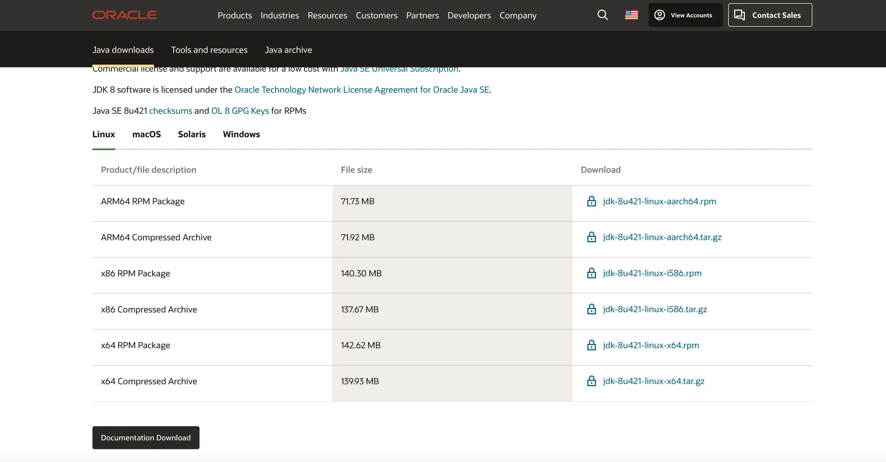
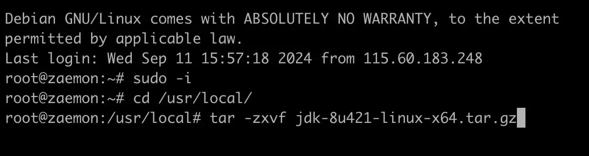
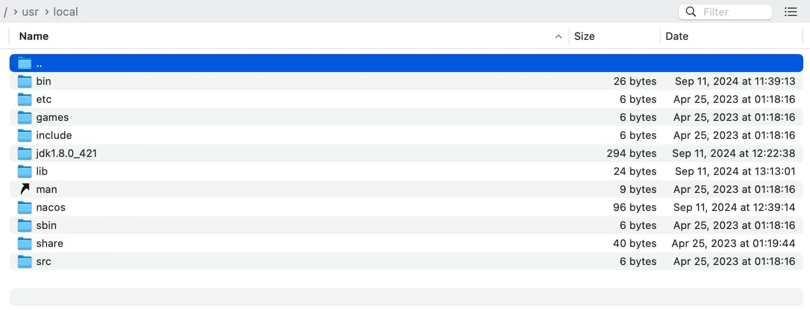
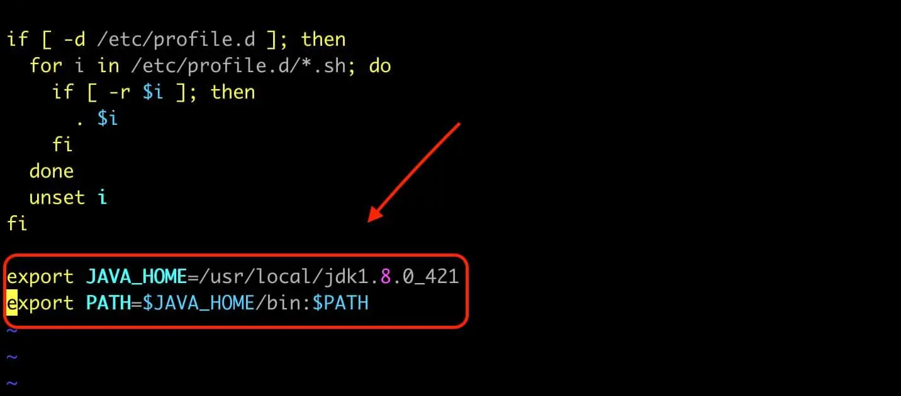
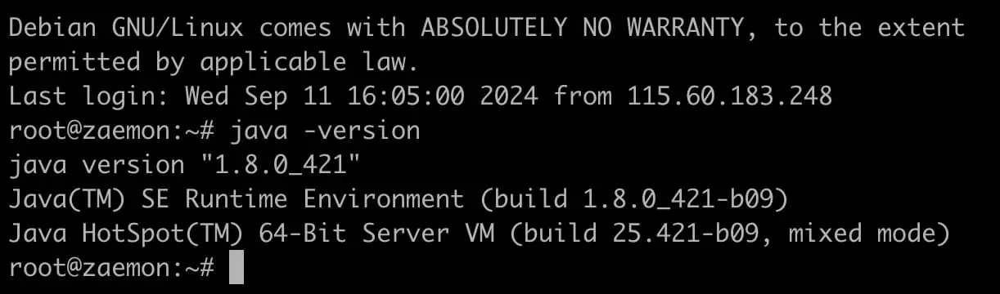

## 1. 下载压缩包
Oracle: [官网链接](https://www.oracle.com/java/technologies/downloads/#java8-linux)

选择对应的版本进行下载，并上传到Linux的 `/usr/local/` 目录下

## 2. 解压文件
命令行先切换用户，再切换目录，然后解压文件(jdk后面就是刚刚上传的文件名)
```bash
sudo -i
cd /usr/local/
tar -zxvf jdk-x.x.x.tar.gz
```

目录下就多了一个 `jdk` 开头的文件夹


## 3. 配置环境并授权
可以选择进行安装vim进行文件编辑，或者使用自己熟悉的nano、vi之类的
```bash
apt install vim     # 如果没有安装vim的话
vim /etc/profile
```
在文件内容最后面添加下面信息， `/usr/local/` 后面应的是刚刚解压出来的文件夹，不知道文件夹名字的话可以输入 `ls -l` 进行查看
```json
export JAVA_HOME=/usr/local/jdkx.x.x_xxx
export PATH=$JAVA_HOME/bin:$PATH
```


## 4. 验证结果
```bash
java -version
```
进行验证JDK环境是否配置好了，出现类似下面的信息就是安装好了
