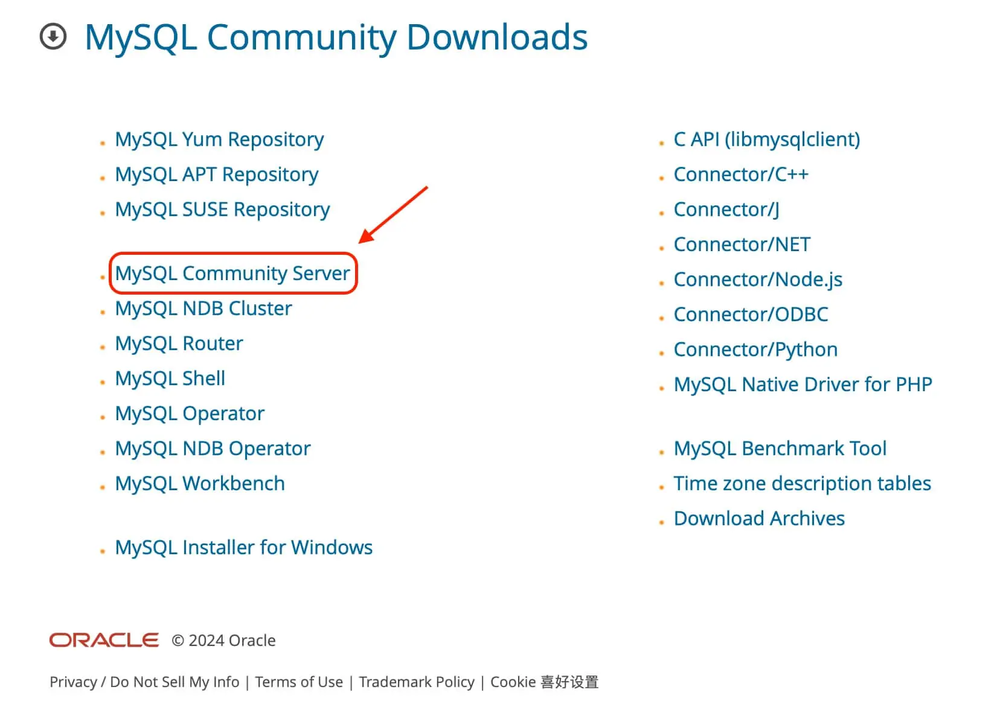
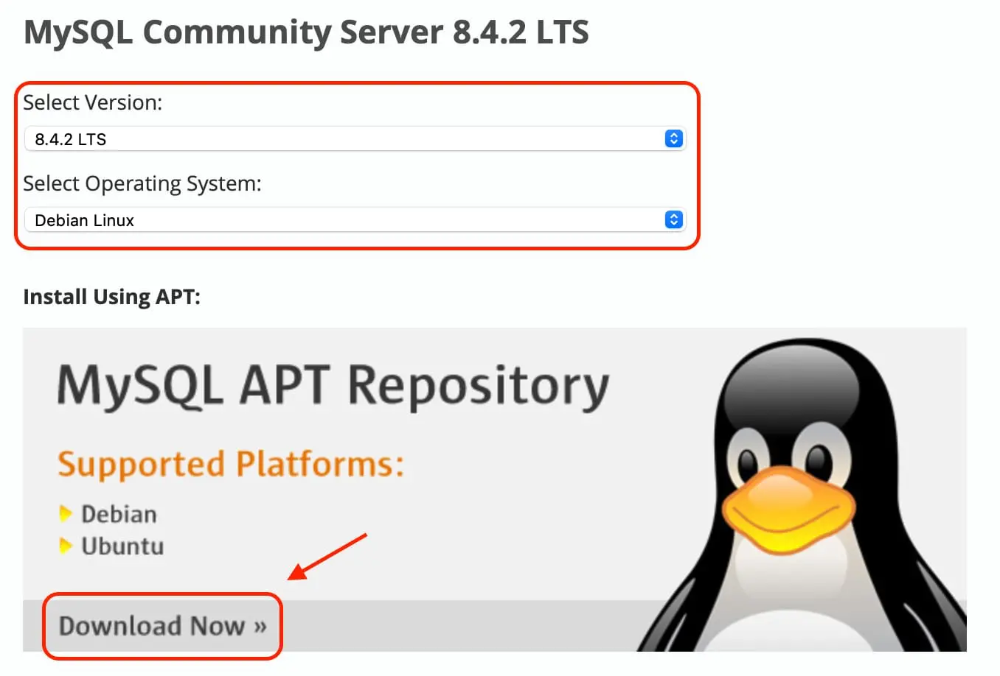
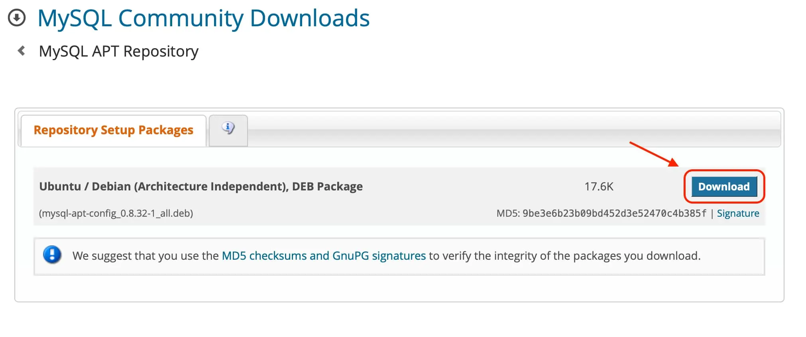
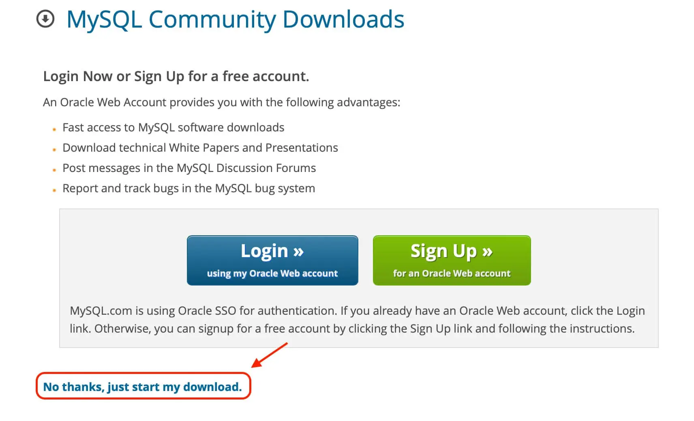
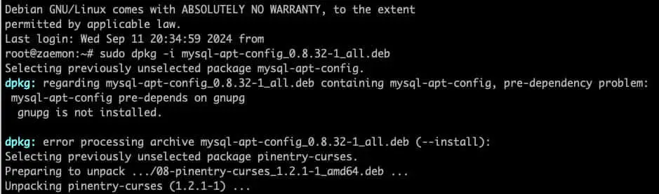
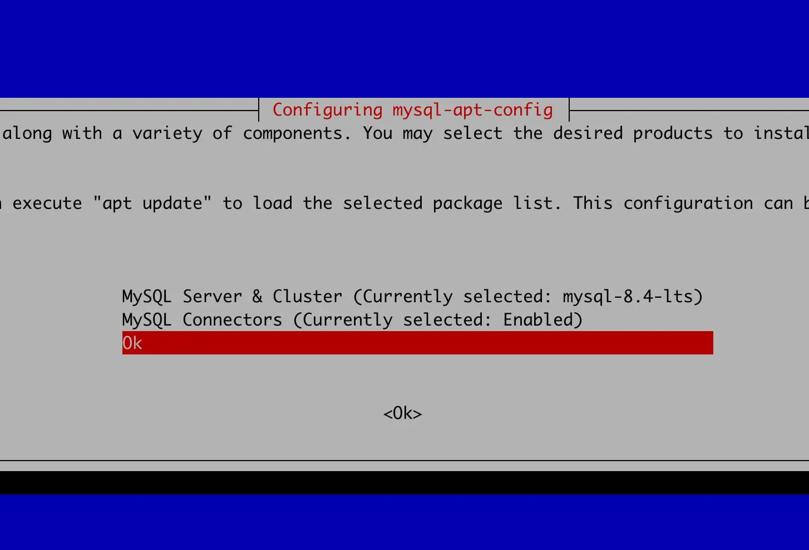
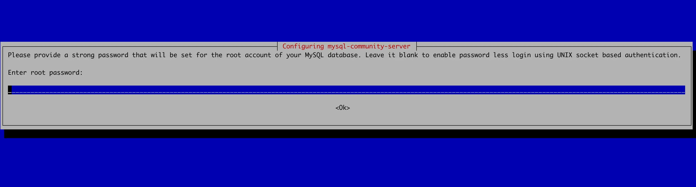
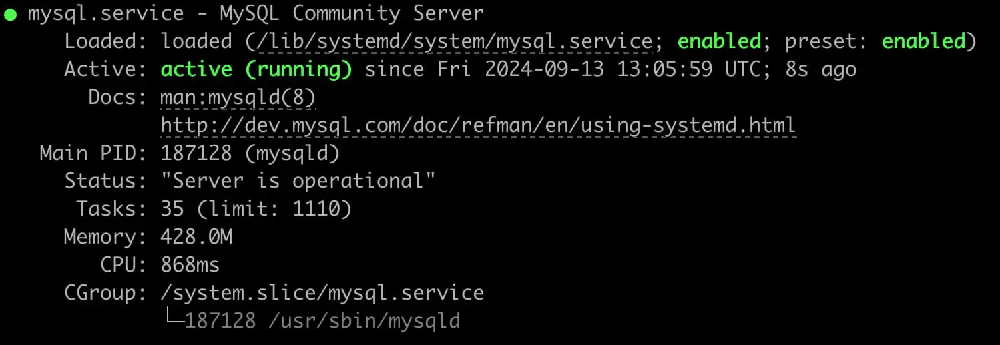
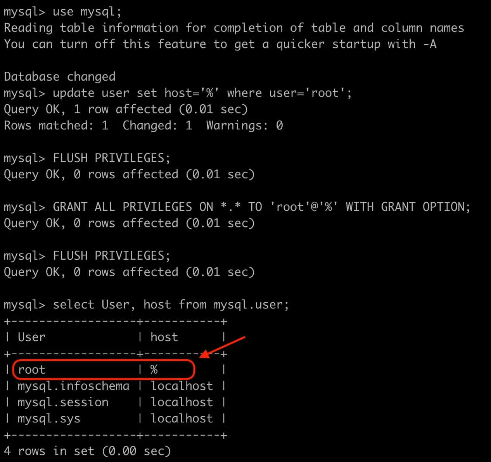
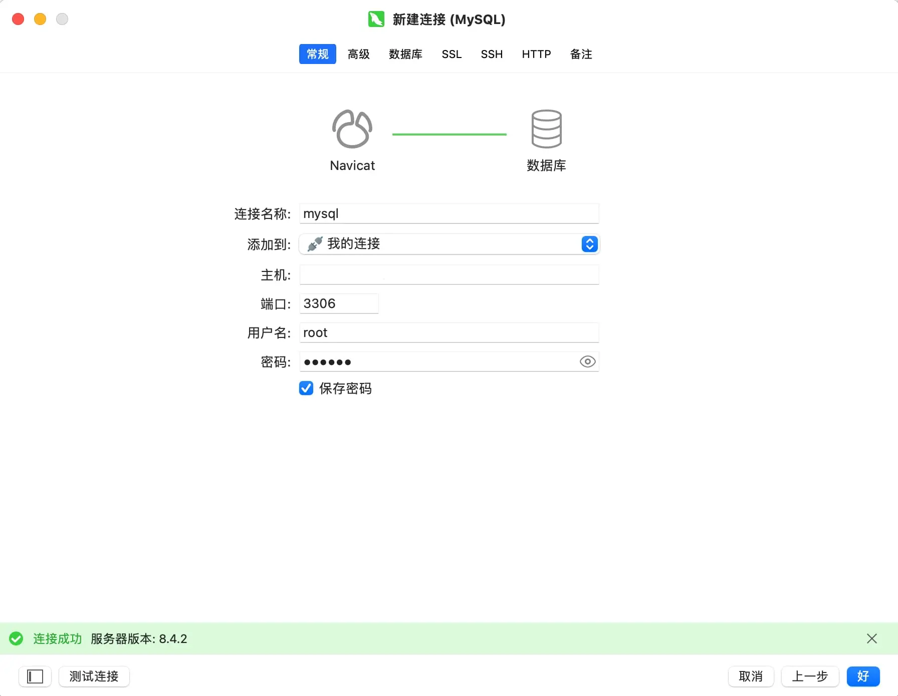

## 1. 下载安装包
打开 [MySQL官网](https://dev.mysql.com/downloads/) 点击 `MySQL Community Server`

选择对应系统和对应版本，然后点击`Download Now`，再点击`Download`


点击 `No thanks, just start my download.` 进行下载


## 2. 安装MySQL
把刚刚下载的 `.deb` 的文件上传到服务器 `/root/` 目录下（或者任何目录都行）

```bash
sudo -i
dpkg -i mysql-apt-config_0.8.32-1_all.deb
```

:::warning
如果出现上面的提示，先运行
:::
```bash
apt install wget && apt install -y wget gnupg   # 再重新运行上面 dpkg 的命令
```
跳出界面后，使用键盘的 `↓`，选中 `ok` 继续执行

```bash
apt-get update      # 执行成功后，进行更新
apt-get install mysql-server   # 安装 mysql
```
继续安装过程，到这个页面（连续2次）输入密码

等待安装完成，完成之后输入 `systemctl status mysql`命令查看MySQL运行状态，跟下面的一样就是成功了


## 3. 登录MySQL并配置远程访问
命令行 `mysql -u root -p` 输入安装时设置的密码（输入密码的时候不会有显示的），然后按 `Enter `键登录<br/>
按下面命令修改配置允许远程访问
```json
use mysql;
update user set host='%' where user='root';
FLUSH PRIVILEGES;
GRANT ALL PRIVILEGES ON *.* TO 'root'@'%' WITH GRANT OPTION;
FLUSH PRIVILEGES;
select User, host from mysql.user;
```
这样就是配置成功了


## 4. Navicat连接
打开 `Navicat`（或者其他数据库图形客户端），输入服务器IP、端口（默认是3306）、密码， 然后点击左下角的测试连接，提示连接成功就大功告成了


<br><br/>

:::tip
MySQL相关命令
:::
```bash
systemctl enable mysql    # 开机自启MySQL
systemctl disable mysql   # 禁用自启MySQL
systemctl status mysql    # 查看MySQL运行状态
systemctl restart mysql   # 重启MySQL
systemctl stop mysql      # 关闭MySQL
# 卸载MySQL   
apt-get autoremove mysql-server
apt-get -f install
apt-get remove --purge mysql-\*
```