## 1. 必要前提
Nacos依赖Java环境来运行，并且需要 `JDK-1.8` 及以上
可以输入 `java -version` 命令来检查是否已经安装了Java，如果有打印出Java的版本信息则表示已经安装过了
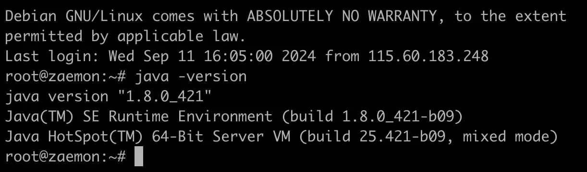
如果没有可以参考我 [JDK安装教程](/posts/jdk-tutorial/) 的帖子进行安装

## 2. 下载压缩包
Nacos官网：[链接](https://nacos.io/)<br/>
GitHub仓库：[地址](https://github.com/alibaba/nacos)<br/>
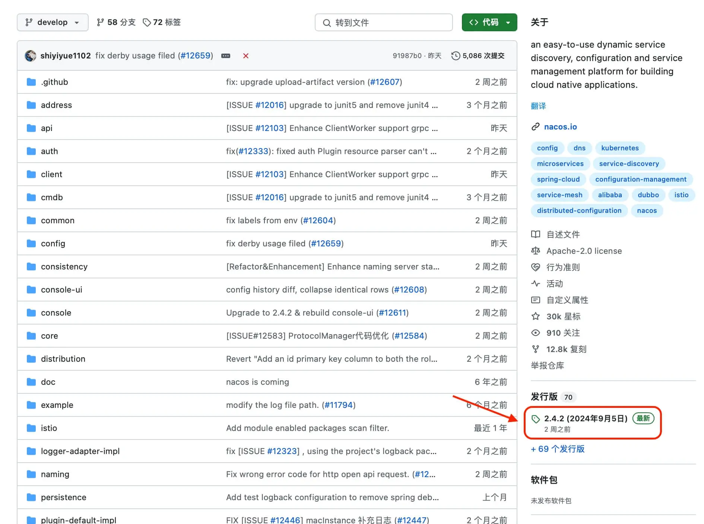
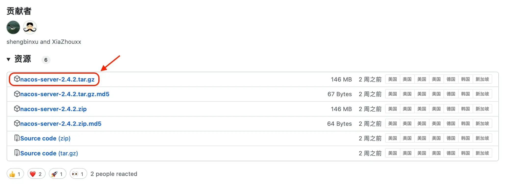
打开 `GitHub` 仓库点击右侧的 `Release` ，跳转页面后再往下拉到 `Assets` 选择对应的版本进行下载， 并将 `tar.gz` 上传到服务器的 `/usr/local/` 目录下

## 3. 解压文件
SSH客户端连接服务器，切换用户，切换目录并解压文件，解压完成之后会在当前目录下生成一个 `nacos` 的文件夹
```bash
sudo -i
cd /usr/local/
tar -zxvf nacos-server-x.x.x.tar.gz   # 替换成上传的具体文件名
```
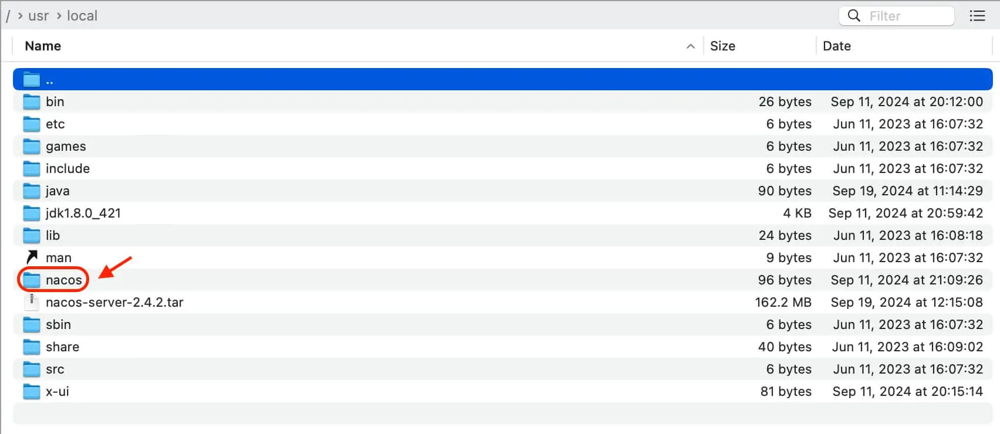

## 4. 基本配置
打开 `.sh` 文件进行编辑，把 `JAVA_HOME=` 后面改成自己JDK的环境配置路径，然后保存退出
```bash
vim /usr/local/nacos/bin/startup.sh
```
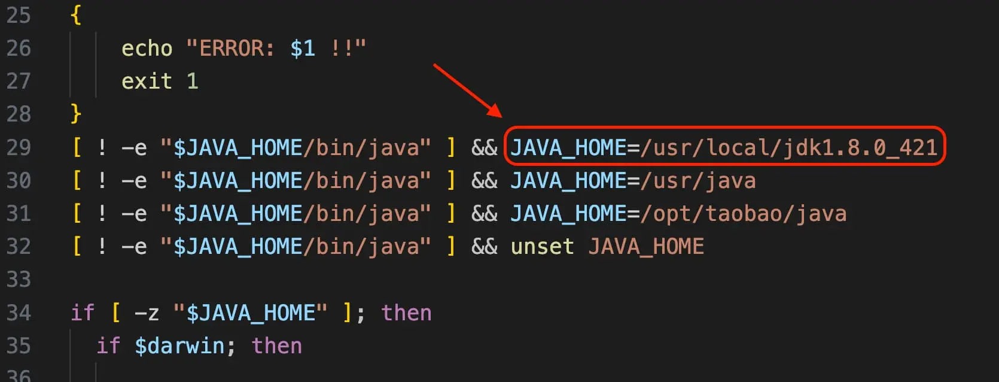
打开 `.properties`文件进行编辑， `server.port=8848` 表示默认的端口是 `8848` ，可根据自己实际情况进行修改
```bash
vim /usr/local/nacos/conf/application.properties
```
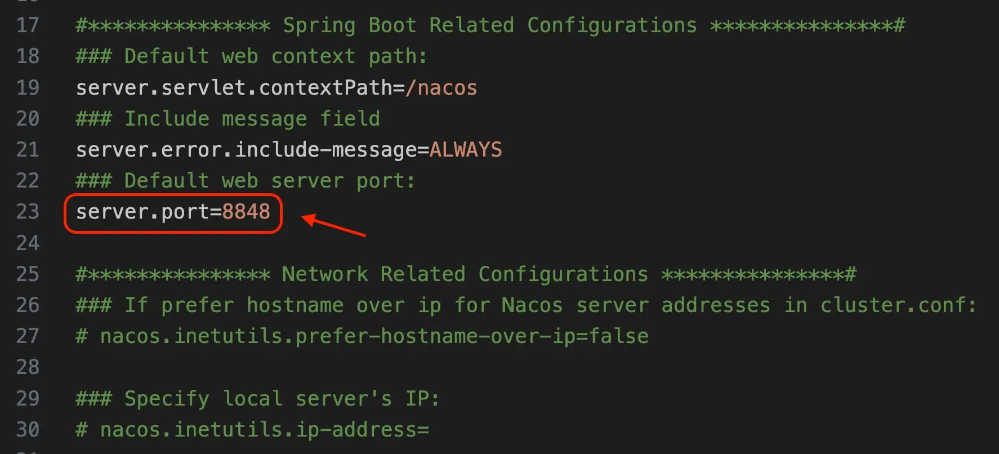
把框框标记的内容前面的 `#` 号都去掉，增加支持MySQL数据源配置（目前只支持MySQL），添加 `mysql` 数据源的 `url` 、 用户名和密码（MySQL可以本地或者其他远程可用的）
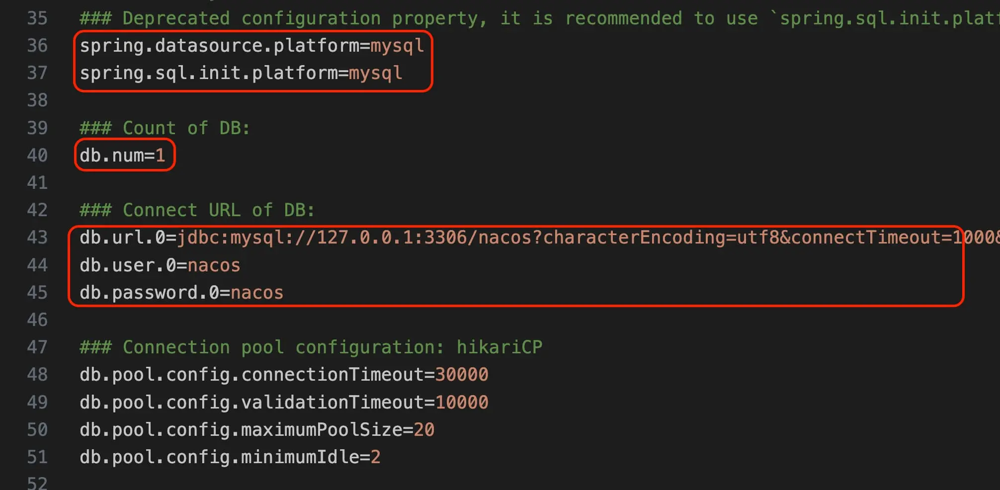
在MySQL数据库中新建一个名为 `nacos` 的数据库，然后执行 `/usr/local/nacos/conf/` 目录下的 `mysql-schema.sql` 文件，如果上面的用户名和密码都填的 `nacos`，那么数据库中也要新增对应的用户密码及授权（相关的可自行百度）
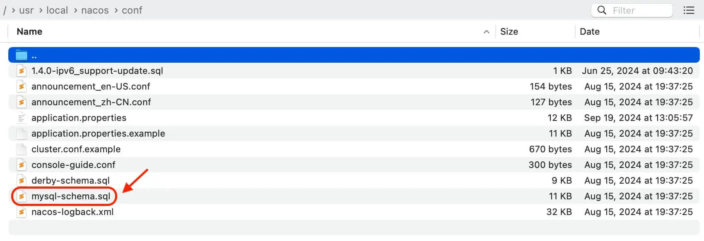

## 5. 开启鉴权
如果没开鉴权页面上会出现这样的提示
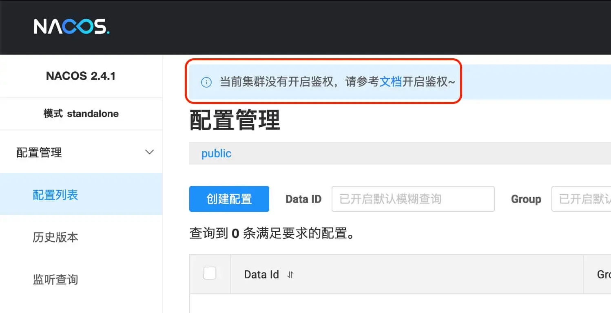
继续编辑上面的 `application.properties`文件，把内容为 `nacos.core.auth.enabled=false` 这行的 `false`改成 `true`，
这两行的 `key` 、 `value` 填上你想要的用户名和密码
```json
nacos.core.auth.server.identity.key=nacos
nacos.core.auth.server.identity.value=nacos
```
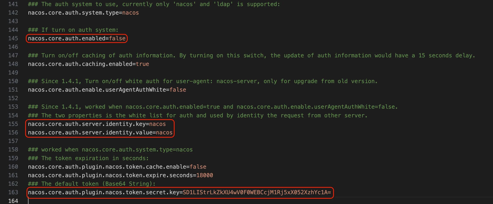
```bash
nacos.core.auth.plugin.nacos.token.secret.key=
```
填上自定义密钥时，推荐将配置项设置为 `Base64` 编码的字符串，且原始密钥长度不得低于32字符（Base64相关的可自行百度）， 修改完之后保存退出

## 6. 单机模式
运行Nacos单机模式和查看日志信息
```bash
bash /usr/local/nacos/bin/startup.sh -m standalone
cat /usr/local/nacos/logs/start.out
```
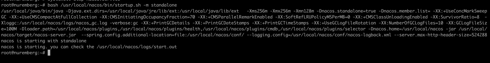
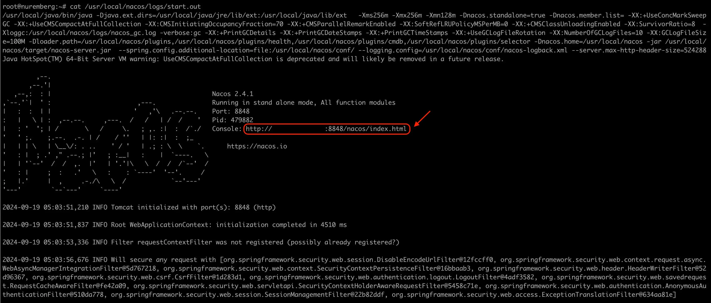
运行成功之后，把日志里面的 `http` 地址复制出来，打开浏览器粘贴地址回车访问，开启鉴权之后就需要输入用户名和密码了（输入刚刚在文件中填入的密码）
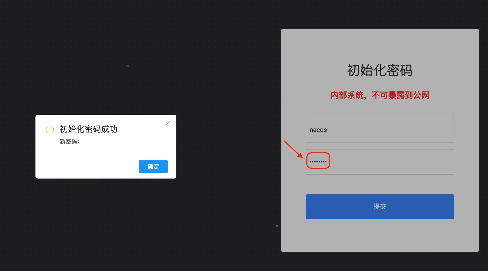
提交之后就会提示初始化密码成功点确认，然后再次输入用户名密码就能进入 `Nacos` 配置管理界面 （初始化密码成功确认之后为什么会跳没有权限我也不清楚，但并不影响使用），到这安装和配置就已经结束了，关闭命令（可选）
```bash
bash /usr/local/nacos/bin/shutdown.sh
```

## 7. 编写Systemd服务，设置nacos开机自启
```yml
cat > /lib/systemd/system/nacos.service << EOF
[Unit]
Description=nacos
After=network.target

[Service]
Type=forking
ExecStart=/usr/local/nacos/bin/startup.sh -m standalone
ExecReload=/usr/local/nacos/bin/shutdown.sh
ExecStop=/usr/local/nacos/bin/shutdown.sh
PrivateTmp=true

[Install]
WantedBy=multi-user.target
EOF
```

<br><br/>
:::tip
Nacos相关命令
:::
```json
systemctl daemon-reload              #重新加载服务配置
systemctl enable nacos.service       #设置为开机启动
systemctl start nacos.service        #启动nacos服务
systemctl stop nacos.service         #停止nacos服务
systemctl stop firewalld.service     #停止防火墙
systemctl disable firewalld.service  #禁止防火墙开机启动
```
