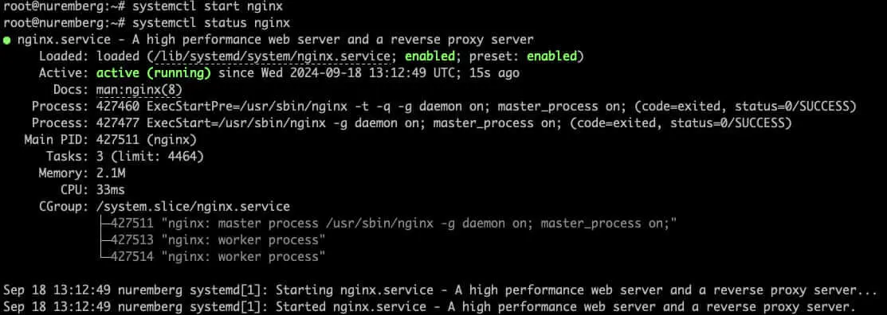
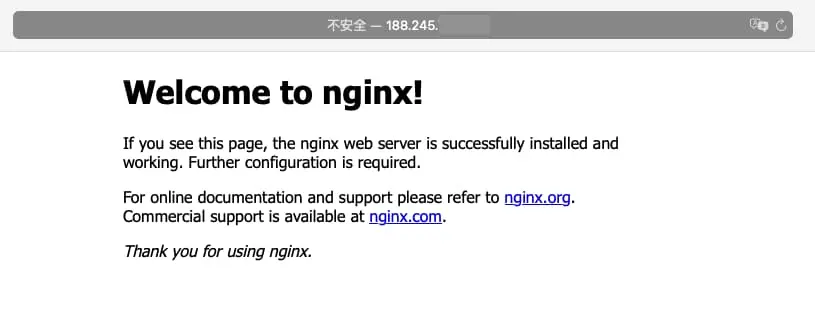
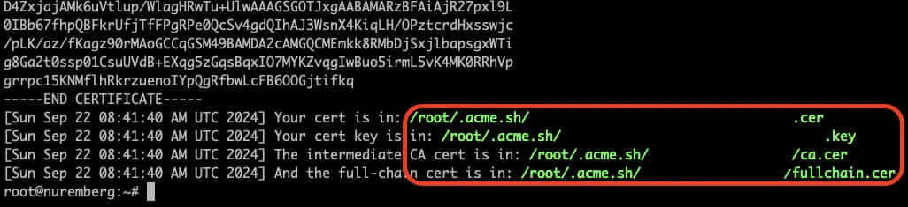
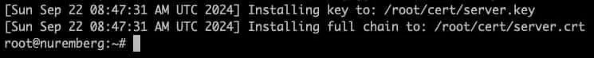
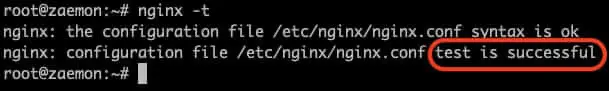

## 1. 安装Nginx
```bash
sudo -i                          # 切换用户
apt update && sudo apt upgrade   # 更新系统
apt install nginx                # 安装Nginx
systemctl start nginx            # 启动Nginx
systemctl status nginx           # 查看Nginx状态
```


## 2. 验证结果
打开浏览器输入服务器 `IP` 回车访问出现下面信息说明 `Nginx` 可以用了，到此安装教程就已经结束了


## 3. 申请SSL证书（如果你的服务器已经申请了证书可以跳过这一步）
将域名解析到服务器 `IP` ，使用 `Cloudflares` 或者其他的都行
```bash
curl https://get.acme.sh| sh                         # 安装acme
apt install socat                                    # 安装socat
ln -s /root/.acme.sh/acme.sh /usr/local/bin/acme.sh  # 添加软链接
acme.sh --set-default-ca --server letsencrypt        # 切换CA机构
acme.sh --issue -d 你的域名 --standalone -k ec-256    #申请证书
```

生成目录 `mkdir /root/cert/`（目录位置可根据自己实际情况调整），安装证书
```bash
acme.sh --installcert -d 你的域名 --ecc --key-file /root/cert/server.key --fullchain-file /root/cert/server.crt
```


## 4. 修改配置文件反向代理HTTPS
在 Nginx 的配置文件中，设置反向代理将根目录请求代理到 8080 端口上的服务
配置文件通常位于
```text
/etc/nginx/sites-available/default
或者
/etc/nginx/sites-enabled/your_site.conf
```
编辑配置文件如下：（ `yourdomain.com` 都替换成你申请了 `SSL` 的域名）
```text
server {
    listen 80;
    server_name yourdomain.com www.yourdomain.com;

    # 强制 HTTP 重定向到 HTTPS
    return 301 https://$host$request_uri;
}

server {
    listen 443 ssl;
    server_name yourdomain.com www.yourdomain.com;

    ssl_certificate /root/cert/server.crt;   # 公钥文件路径
    ssl_certificate_key /root/cert/server.key; # 私钥文件路径

    ssl_protocols TLSv1.2 TLSv1.3;
    ssl_prefer_server_ciphers on;

    location / {
       proxy_pass http://127.0.0.1:8080;  # 将请求转发到本地 8080 端口
       proxy_set_header Host $host;
       proxy_set_header X-Real-IP $remote_addr;
       proxy_set_header X-Forwarded-For $proxy_add_x_forwarded_for;
       proxy_set_header X-Forwarded-Proto $scheme;
    }
}
```
检查配置文件的语法正确性 `nginx -t` ，如图中配置正确，重启 `Nginx`

```bash
systemctl restart nginx
```
打开浏览器，访问 `https://yourdomain.com` ，检查是否成功通过 `HTTPS` 访问并正确代理到 `8080` 端口上的服务

<br><br/>
:::warning
注意事项
:::
```text
1. 防火墙设置：确保服务器允许80和443端口的访问，并且8080端口的服务正在正常运行
2. 自动续期：如果你使用的是Let’s Encrypt，certbot会自动续期证书，确保你的HTTPS持续可用
3. 安全性：为了提高安全性，确保你只允许通过HTTPS访问，并禁用不必要的协议和加密方式（如 SSLv3、TLSv1.0 等）
```