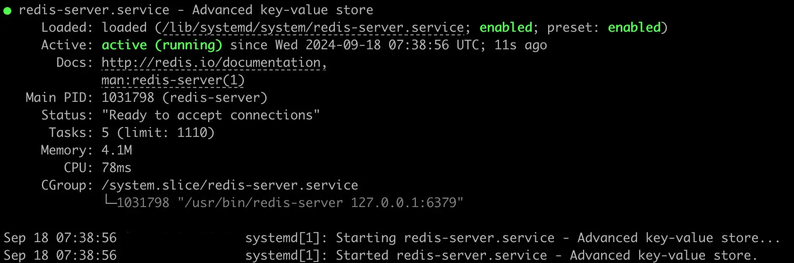
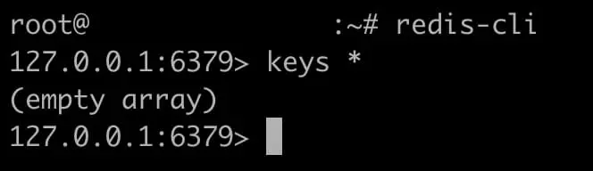
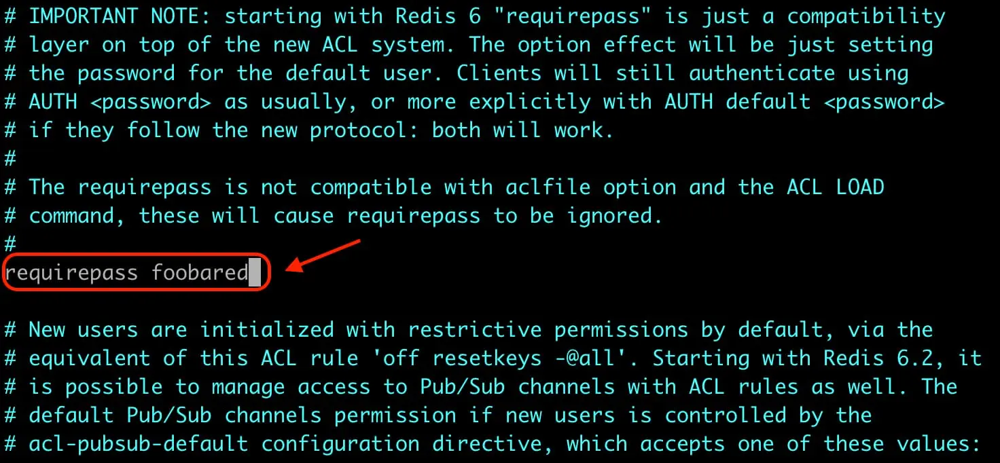
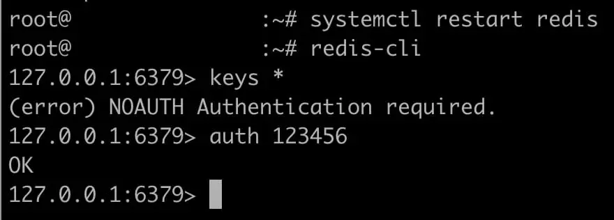
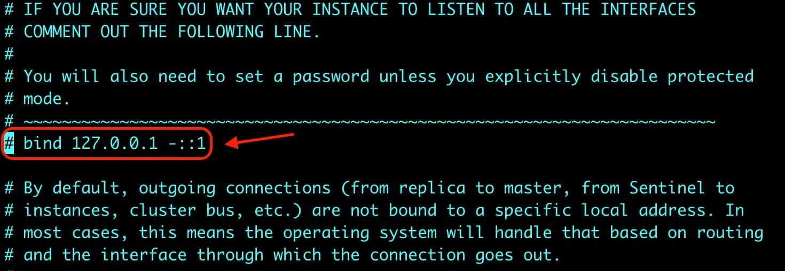
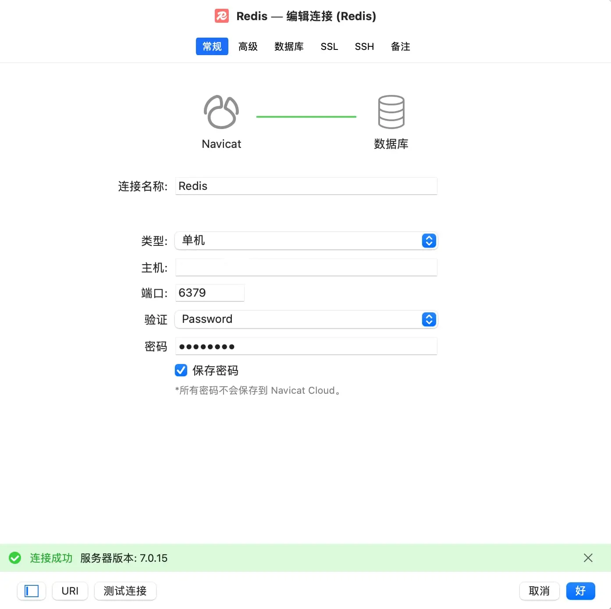

## 1. 安装Redis
```bash
sudo -i
apt update -y
apt install redis-server
systemctl status redis
```
运行命令切换用户，更新系统信息，安装Redis，查看运行状态，查询状态如下，说明 `redis` 服务已安装成功并启动


## 2. 验证Redis
```bash
redis-cli
keys *
```
进入 `redis` 之后运行命令，如下图说明Redis可正常使用，默认是没有密码的，输入exit可退出Redis


## 3. 修改密码
修改配置文件（vi和nano或者其他的都行，用什么修改看个人习惯）
```bash
vim /etc/redis/redis.conf
```
找到 `# requirepass foobared` 这行，把前面的 `# `号去掉，然后再把的 `foobared` 换成你想要设置的密码

重启Redis服务 `systemctl restart redis`
验证密码，按顺序输入下面命令，（******就是刚刚修改保存的密码），验证成功会提示：`OK`，输入 `exit` 可退出Redis
```bash
redis-cli
keys *
auth ******
```


## 4. 配置远程访问
```bash
vim /etc/redis/redis.conf
```
修改配置文件，找到 `bind 127.0.0.1 ::1` 在前面加个 `#` 号将其注释掉，然后保存修改并重启Redis服务 
```bash
systemctl restart redis
```


## 5. 配置图形界面
打开Redis图形管理客户端（教程用的是 `Navicat`，你们可以选择 `RedisDesktopManager` 或者 `Tiny RDM` ）
输入IP、密码、端口（默认是6379），然后点击左下角的测试连接，提示连接成功说明远程连接已经开启了


<br><br/>

:::tip
Redis相关命令
:::
```json
systemctl start redis      # 启动服务
systemctl stop redis       # 停止服务
systemctl restart redis    # 重启服务
systemctl enable redis-server.service   # 开机自启
systemctl disable redis-server.service  # 禁用开机自启
```